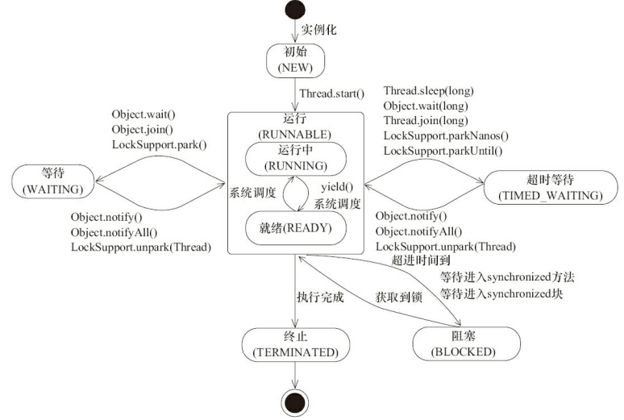

# 多线程
<!--email_off-->
目录
<!-- toc -->

参考文章:
* [Java - Multithreading](https://www.tutorialspoint.com/java/java_multithreading.htm)
* [Multithreading in java with examples](http://beginnersbook.com/2013/03/multithreading-in-java/)


## HelloWorld
在 Java 中有两种方式创建线程，第一种方式是实现 `Runnable` 接口，第二种方式是继承 `Thread` 类，下面是使用示例：
```java
public class RunnableDemo implements Runnable{
    @Override
    public void run() {
        System.out.println("I am in runnable Demo");
    }

    public static void main(String[] args) {
        Thread thread = new Thread(new RunnableDemo());
        thread.start();
    }
}
```

```java
public class ThreadDemo extends Thread{
    @Override
    public void run() {
        System.out.println("I am in Thread Demo");
    }

    public static void main(String[] args) {
        Thread thread = new ThreadDemo();
        thread.start();
    }
}
```
如果启动线程，需要调用 `start` 方法，直接运行 `run` 不会启动新的线程。

## 线程状态
在线程执行期间，会经历多种状态，下面是一个示意图：


> 图片来自 Java 并发编程的艺术

下面是线程生命周期对应的几种状态
* New - 初始状态，线程刚被创建，但是还没有调用 `start` 方法
* Runnable(Ready to run) - 可运行状态，其他线程调用了该线程的 `start` 方法。该状态的位于可运行的线程池中，等待被线程调度选中，获得 CPU 的使用权。
* Running - 运行状态，Runnable 线程获得了 CPU 使用权，执行程序代码。
* Blocked - 阻塞状态，表示线程被锁阻塞。例如进入 `synchronized` 同步块时等待锁。
* Waiting - 等待状态，处于该状态的线程一个是调用了下面3个方法：`Object.wait`, `Thread.join` 或者 `LockSupport.park`。处于 Waiting 状态的线程需要等待其他线程做出一些特定行为，例如通过调用 `Object.wait()` 等待的线程需要另外一个线程执行 `Object.notify()` 或者 `Object.notifyAll()` 来唤醒。
* Time Waiting - 超时等待，当等待时间超过指定时间后会自行返回。
* Terminated - 终止状态，表示线程已经执行完毕

在 JDK 中定义了线程的六种状态，位于 `Thread.State` 中，下面是 `State` 的定义：
```java
public enum State {
    /**
     * Thread state for a thread which has not yet started.
     */
    NEW,

    /**
     * Thread state for a runnable thread.  A thread in the runnable
     * state is executing in the Java virtual machine but it may
     * be waiting for other resources from the operating system
     * such as processor.
     */
    RUNNABLE,

    /**
     * Thread state for a thread blocked waiting for a monitor lock.
     * A thread in the blocked state is waiting for a monitor lock
     * to enter a synchronized block/method or
     * reenter a synchronized block/method after calling
     * {@link Object#wait() Object.wait}.
     */
    BLOCKED,

    /**
     * Thread state for a waiting thread.
     * A thread is in the waiting state due to calling one of the
     * following methods:
     * <ul>
     *   <li>{@link Object#wait() Object.wait} with no timeout</li>
     *   <li>{@link #join() Thread.join} with no timeout</li>
     *   <li>{@link LockSupport#park() LockSupport.park}</li>
     * </ul>
     *
     * <p>A thread in the waiting state is waiting for another thread to
     * perform a particular action.
     *
     * For example, a thread that has called <tt>Object.wait()</tt>
     * on an object is waiting for another thread to call
     * <tt>Object.notify()</tt> or <tt>Object.notifyAll()</tt> on
     * that object. A thread that has called <tt>Thread.join()</tt>
     * is waiting for a specified thread to terminate.
     */
    WAITING,

    /**
     * Thread state for a waiting thread with a specified waiting time.
     * A thread is in the timed waiting state due to calling one of
     * the following methods with a specified positive waiting time:
     * <ul>
     *   <li>{@link #sleep Thread.sleep}</li>
     *   <li>{@link Object#wait(long) Object.wait} with timeout</li>
     *   <li>{@link #join(long) Thread.join} with timeout</li>
     *   <li>{@link LockSupport#parkNanos LockSupport.parkNanos}</li>
     *   <li>{@link LockSupport#parkUntil LockSupport.parkUntil}</li>
     * </ul>
     */
    TIMED_WAITING,

    /**
     * Thread state for a terminated thread.
     * The thread has completed execution.
     */
    TERMINATED;
}
```
### 获得线程状态
Thread 类提供了 `getState` 方法来获得线程状态，下面是一个使用示例：
```java
public class StateDemo extends Thread {

    @Override
    public void run() {
        System.out.printf("%-18s %s\n","in run method:", getState());
    }

    public static void main(String[] args) throws InterruptedException {
        Thread thread = new StateDemo();
        System.out.printf("%-18s %s\n","init:",  thread.getState());
        thread.run();
        System.out.printf("%-18s %s\n", "after run:", thread.getState());
        thread.start();
        System.out.printf("%-18s %s\n","after start:", thread.getState());
        Thread.sleep(1);
        System.out.printf("%-18s %s\n","finish:", thread.getState());
    }
}
```
## 线程优先级
在 Java 标准中，可以通过设置优先级来调整线程获得时间片的优先程度。Java 中定义的线程优先级的范围是1~10，默认优先级是 5，下面是 Thread 类中关于几个变量的定义：
```java
/**
 * The minimum priority that a thread can have.
 */
public final static int MIN_PRIORITY = 1;

/**
 * The default priority that is assigned to a thread.
 */
public final static int NORM_PRIORITY = 5;

/**
 * The maximum priority that a thread can have.
 */
public final static int MAX_PRIORITY = 10;
```
通过 `setPriority` 方法可以设置线程的优先级。原则上优先级高的线程会优先获得执行时间，但是并不能保证一定会这样，而且在不同的 JVM 以及操作系统中，对线程优先级的划分和优先级的支持程度是不一样，有些操作系统有可能会忽略优先级的设定。下面是一个使用线程优先级的示例：
```java
public class PriorityDemo {

    public static void main(String[] args) {
        Thread thread = new Thread(new Runnable() {
            @Override
            public void run() {
                for (int i = 0; i < 10; i++) {
                    System.out.println(Thread.currentThread().getName() + "(" + Thread.currentThread().getPriority() + ")"
                            + ", loop " + i);
                }
            }
        });

        Thread thread2 = new Thread(new Runnable() {
            @Override
            public void run() {
                for (int i = 0; i < 10; i++) {
                    System.out.println(Thread.currentThread().getName() + "(" + Thread.currentThread().getPriority() + ")"
                            + ", loop " + i);
                }
            }
        });

        thread.setPriority(1);
        thread2.setPriority(10);
        thread.start();
        thread2.start();
    }
}
```
输出结果为：
```
Thread-0(1), loop 0
Thread-0(1), loop 1
Thread-0(1), loop 2
Thread-0(1), loop 3
Thread-0(1), loop 4
Thread-0(1), loop 5
Thread-0(1), loop 6
Thread-0(1), loop 7
Thread-0(1), loop 8
Thread-0(1), loop 9
Thread-1(10), loop 0
Thread-1(10), loop 1
Thread-1(10), loop 2
Thread-1(10), loop 3
Thread-1(10), loop 4
Thread-1(10), loop 5
Thread-1(10), loop 6
Thread-1(10), loop 7
Thread-1(10), loop 8
Thread-1(10), loop 9
```
从结果可以看到，优先级并没有起到什么作用。所以程序的正确性不能依赖线程的优先级高低。


http://stackoverflow.com/questions/7067578/when-are-daemon-threads-useful
<!--email_off-->
